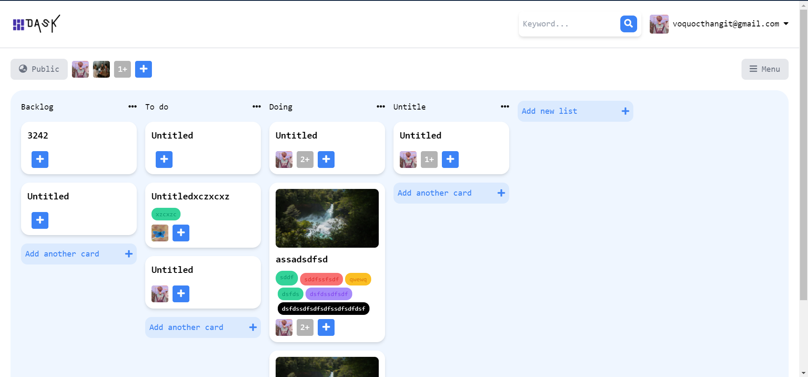

# Dask

A MERN stack application to manage workloads

## [Demo](https://www.youtube.com/watch?v=pcnP7wh5Xrk&feature=emb_title&ab_channel=Th%E1%BA%AFngV%C3%B5)

## [Website](https://vigilant-villani-8c2817.netlify.app/#/)

## User Interface

### Home

### Board

### Task

## Features

- Implememnt jwt
- Drag and Drop task
- Upload image
- Responsive

## Technology

- Reactjs
- Nodejs
- Expressjs
- MongoDB
- Redux
- Tailwind CSS
- Firebase Authentication

## What I learned

- Advanced hooks : useRef, useCallback
- Redux Usage
- Build website with Tailwind CSS
- Using typescript

## Credits

Idea and UI Design was inspired by [devChalleges](https://devchallenges.io/challenges/wP0LbGgEeKhpFHUpPpDh)
